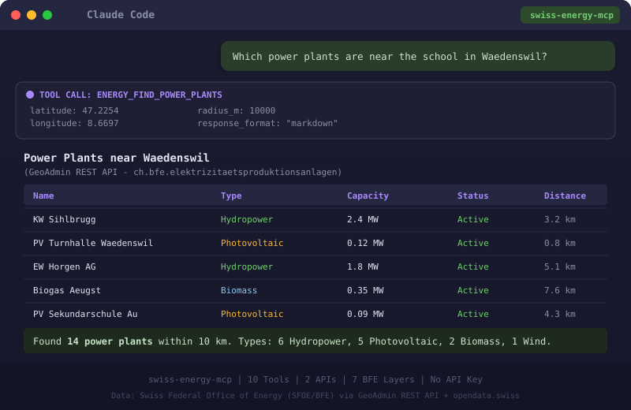

> 🇨🇭 **Part of the [Swiss Public Data MCP Portfolio](https://github.com/malkreide)**

# ⚡ swiss-energy-mcp


[](https://opensource.org/licenses/MIT)
[](https://www.python.org/downloads/)
[](https://modelcontextprotocol.io/)
[](https://www.geo.admin.ch/)


> MCP server for Swiss energy data from the Federal Office of Energy (SFOE/BFE) via GeoAdmin REST API and opendata.swiss — no API key required.

[🇩🇪 Deutsche Version](README.de.md)

<p align="center">
  
</p>

---

## Overview

`swiss-energy-mcp` gives AI assistants structured, location-based access to Switzerland's energy infrastructure. Built on open geodata from the Swiss Federal Office of Energy (SFOE/BFE) via the GeoAdmin REST API and the opendata.swiss catalogue — completely authentication-free.

The server is part of a growing portfolio of Swiss open data MCP servers. Think of it as the energy atlas counterpart to `swiss-road-mobility-mcp`: while the latter maps mobility, this server maps where Switzerland produces electricity, where solar potential exists, and which municipalities hold the "Energiestadt" label.

**Anchor demo query:** *"Which power plants are within 20 km of the school in Wädenswil — and is the municipality an Energiestadt?"*

---

## Features

- 🔍 **10 ready-to-use tools** covering all major energy data layers from SFOE/BFE
- ⚡ **Power plants** — all types: photovoltaic, hydro, wind, biomass, nuclear, with optional category filter
- 💨 **Wind turbines** — detailed data incl. manufacturer, model, hub height, annual production
- 💧 **Hydropower plants** — type, status, turbine capacity, expected annual output
- ☀️ **PV large installations** — project name, capacity, annual/winter production, altitude
- 🌿 **Biogas plants** — plant name, output
- 🏙️ **Energiestädte** — municipalities with the Swiss "Energiestadt" label (score, year awarded, audits)
- 🏠 **Solar roof potential** — suitability category, area, orientation, and slope per roof segment
- 📊 **Location energy profile** — combines 5 layers into a single overview for any Swiss location
- 🗂️ **SFOE dataset search** — full-text search across SFOE publications on opendata.swiss
- ✅ **Status check** — verifies availability of both upstream APIs
- ☁️ **Dual transport** — stdio for Claude Desktop, Streamable HTTP for cloud deployment

---

## Prerequisites

- Python 3.11+
- [`uv`](https://github.com/astral-sh/uv) (recommended) or `pip`

---

## Installation

### Claude Desktop (stdio transport)

Add to your `claude_desktop_config.json`:

```json
{
  "mcpServers": {
    "swiss-energy-mcp": {
      "command": "uvx",
      "args": ["swiss-energy-mcp"]
    }
  }
}
```

**Config file locations:**
- macOS: `~/Library/Application Support/Claude/claude_desktop_config.json`
- Windows: `%APPDATA%\Claude\claude_desktop_config.json`

### Local development

```bash
git clone https://github.com/malkreide/swiss-energy-mcp.git
cd swiss-energy-mcp
uv sync
uv run swiss-energy-mcp
```

### Cloud / HTTP transport (Streamable HTTP)

For use via **claude.ai in the browser** (e.g. on managed workstations without local software):

```bash
SWISS_ENERGY_TRANSPORT=http uvx swiss-energy-mcp
```

> 💡 *"stdio for the developer laptop, HTTP for the browser."*

---

## Quickstart

Once connected in Claude Desktop, try:

```
What power plants are within 20 km of Bern?
Show me all wind turbines in the Jura region.
Is Zürich an Energiestadt? What's their score?
What is the solar potential of rooftops near lat=47.37, lon=8.54?
Give me a full energy profile for the region around Lucerne.
Find SFOE datasets about hydropower.
```

---

## Available Tools

| Tool | Description |
|---|---|
| `energy_find_power_plants` | All electricity generation plants within a radius (optional category filter) |
| `energy_find_wind_turbines` | Wind turbines with manufacturer, model, hub height |
| `energy_find_hydro_plants` | Hydropower plants with capacity and expected output |
| `energy_find_pv_installations` | Large PV installations with annual/winter production |
| `energy_find_biogas_plants` | Biogas plants |
| `energy_find_energy_cities` | Municipalities with "Energiestadt" label |
| `energy_solar_potential` | Solar suitability of roof segments at a location |
| `energy_location_profile` | Combined energy profile (5 layers) for a location |
| `energy_search_bfe_datasets` | Full-text search over SFOE datasets on opendata.swiss |
| `energy_check_status` | Check availability of GeoAdmin and opendata.swiss APIs |

All tools accept WGS84 coordinates (lat/lon). Conversion to Swiss LV95 is handled internally.

### Example Use Cases

| Query | Tool |
|---|---|
| *"Power plants near Bern (20 km radius)?"* | `energy_find_power_plants` |
| *"Wind turbines in the Jura?"* | `energy_find_wind_turbines` |
| *"Is Zürich an Energiestadt?"* | `energy_find_energy_cities` |
| *"Solar potential of rooftops near lat=47.37, lon=8.54?"* | `energy_solar_potential` |
| *"Full energy profile for Lucerne region?"* | `energy_location_profile` |
| *"SFOE datasets on hydropower?"* | `energy_search_bfe_datasets` |

[→ More use cases by audience →](EXAMPLES.md)

---

## Data Sources

| Source | URL | Auth |
|---|---|---|
| GeoAdmin REST API (swisstopo) | `api3.geo.admin.ch` | None |
| opendata.swiss CKAN API | `opendata.swiss/api/3/action` | None |

**BFE Layers used:**
- `ch.bfe.elektrizitaetsproduktionsanlagen`
- `ch.bfe.windenergieanlagen`
- `ch.bfe.statistik-wasserkraftanlagen`
- `ch.bfe.photovoltaik-grossanlagen`
- `ch.bfe.biogasanlagen`
- `ch.bfe.energiestaedte`
- `ch.bfe.solarenergie-eignung-daecher`

---

## Configuration

All variables use the `SWISS_ENERGY_` prefix and are validated at startup.

| Environment variable | Default | Description |
|---|---|---|
| `SWISS_ENERGY_TRANSPORT` | `stdio` | Transport mode: `stdio` or `http` |
| `SWISS_ENERGY_HOST` | `127.0.0.1` | Host for HTTP transport. Bind `0.0.0.0` only inside a container. |
| `SWISS_ENERGY_PORT` | `8000` | Port for HTTP transport |
| `SWISS_ENERGY_CORS_ORIGINS` | `https://claude.ai` | Comma-separated allowed CORS origins (HTTP transport) |
| `SWISS_ENERGY_LOG_LEVEL` | `INFO` | Log level: `DEBUG` / `INFO` / `WARNING` / `ERROR` |
| `SWISS_ENERGY_HTTP_TIMEOUT` | `20` | Upstream HTTP timeout in seconds |

See [`.env.example`](.env.example) for a template.

---

## MCP Protocol Version

This server targets the MCP protocol version shipped with the pinned `mcp`
SDK (`mcp[cli] >= 1.20.0`). SDK updates arrive monthly via Dependabot;
protocol-version changes are recorded in [CHANGELOG.md](CHANGELOG.md).

## MCP Primitives

The server uses all three MCP primitives:

- **Tools** — 10 read-only tools (see above). Every search tool returns an
  `EnergyResponse` envelope: structured `results` plus a Markdown `summary`,
  explicit `source` / `license` attribution, and a `match_type` field.
- **Resource** — `energy://layers`, the static catalogue of BFE GeoAdmin layers.
- **Prompt** — `energy_site_assessment`, a guided location-analysis template.

## Development Phase

The server is in **Phase 1 (read-only)**. See [docs/roadmap.md](docs/roadmap.md)
for the phased architecture and [docs/security.md](docs/security.md) for the
egress allow-list, SSRF protection and trifecta assessment.

---

## Safety & Limits

| Aspect | Details |
|--------|---------|
| **Access** | Read-only (`readOnlyHint: true`) — the server cannot modify or delete any data |
| **Personal data** | No personal data — all sources are aggregated, public infrastructure data |
| **Rate limits** | Built-in per-query caps (max 50 search results, default 5 km radius) |
| **Timeout** | 20 seconds per API call |
| **Authentication** | No API keys required — both APIs are publicly accessible |
| **Licenses** | All data under open licenses via [opendata.swiss](https://opendata.swiss/) (OGD) |
| **Terms of Service** | Subject to ToS of the respective data sources: [GeoAdmin](https://www.geo.admin.ch/), [opendata.swiss](https://opendata.swiss/), [SFOE/BFE](https://www.bfe.admin.ch/) |

---

## Architecture

```
┌─────────────────┐     ┌───────────────────────────┐     ┌──────────────────────────┐
│   Claude / AI   │────▶│   Swiss Energy MCP        │────▶│  SFOE / BFE Open Data    │
│   (MCP Host)    │◀────│   (MCP Server)            │◀────│                          │
└─────────────────┘     │                           │     │  GeoAdmin REST API       │
                        │  10 Tools                 │     │  (api3.geo.admin.ch)     │
                        │  Stdio | HTTP             │     │                          │
                        │                           │     │  opendata.swiss CKAN     │
                        │  server.py (FastMCP)      │     │  (opendata.swiss)        │
                        │  api_client.py            │     └──────────────────────────┘
                        │   LV95 conversion         │
                        │   GeoAdmin queries        │
                        └───────────────────────────┘
```

### Infrastructure Components

| Component | Metaphor | Function |
|---|---|---|
| `api_client.py` | Switchboard | Handles HTTP requests, coordinate conversion, error handling |
| LV95 converter | Translator | Converts WGS84 (lat/lon) to Swiss coordinate system |
| `server.py` | Storefront | Exposes all 10 tools via FastMCP |

---

## Project Structure

```
swiss-energy-mcp/
├── src/
│   └── swiss_energy_mcp/
│       ├── server.py          # FastMCP setup, lifespan, entry point
│       ├── settings.py        # Typed configuration (pydantic-settings)
│       ├── logging_config.py  # Structured JSON logging to stderr
│       ├── api_client.py      # HTTP client, egress guard, LV95 conversion
│       ├── models.py          # Pydantic input/output models
│       ├── formatting.py      # Markdown summary builders
│       ├── resources.py       # Layer-catalogue resource + prompt
│       └── tools/             # One module per tool group
│           ├── installations.py   # power, wind, hydro, PV, biogas
│           ├── places.py          # solar, Energiestadt, location profile
│           └── catalog.py         # dataset search, status
├── tests/
│   ├── test_unit.py         # Pure-unit tests (coords, formatting, egress)
│   ├── test_tools.py        # Tool tests with respx-mocked APIs
│   └── test_live.py         # Live integration tests (marked `live`)
├── docs/                    # roadmap.md, security.md
├── Dockerfile               # Multi-stage build, non-root user
├── pyproject.toml
├── CHANGELOG.md
├── CONTRIBUTING.md
├── LICENSE
├── README.md                # This file (English)
└── README.de.md             # German version
```

---

## Known Limitations

- **GeoAdmin radius search:** Maximum search radius depends on layer density; very large radii may return partial results
- **Solar potential:** Layer `ch.bfe.solarenergie-eignung-daecher` covers building footprints — not all roof types are classified
- **Energiestadt:** Only municipalities with active label are included; historical entries may be incomplete
- **opendata.swiss CKAN:** Full-text search covers metadata only, not document contents

---

## Testing

```bash
# Unit tests (no API key required)
PYTHONPATH=src pytest tests/ -m "not live"

# Live integration tests (network access required)
PYTHONPATH=src pytest tests/ -m "live"
```

---

## Changelog

See [CHANGELOG.md](CHANGELOG.md)

---

## Contributing

See [CONTRIBUTING.md](CONTRIBUTING.md)

---

## License

MIT License — see [LICENSE](LICENSE)

---

## Author

Hayal Oezkan · [malkreide](https://github.com/malkreide)

---

## Credits & Related Projects

- **Data:** [SFOE/BFE](https://www.bfe.admin.ch/) via [GeoAdmin](https://www.geo.admin.ch/) — Swiss Federal Office of Energy
- **Data:** [opendata.swiss](https://opendata.swiss/) — Swiss Open Government Data portal
- **Protocol:** [Model Context Protocol](https://modelcontextprotocol.io/) — Anthropic / Linux Foundation
- **Related:** [swiss-road-mobility-mcp](https://github.com/malkreide/swiss-road-mobility-mcp) — MCP server for Swiss mobility data
- **Related:** [zurich-opendata-mcp](https://github.com/malkreide/zurich-opendata-mcp) — MCP server for Zurich city open data
- **Portfolio:** [Swiss Public Data MCP Portfolio](https://github.com/malkreide)
